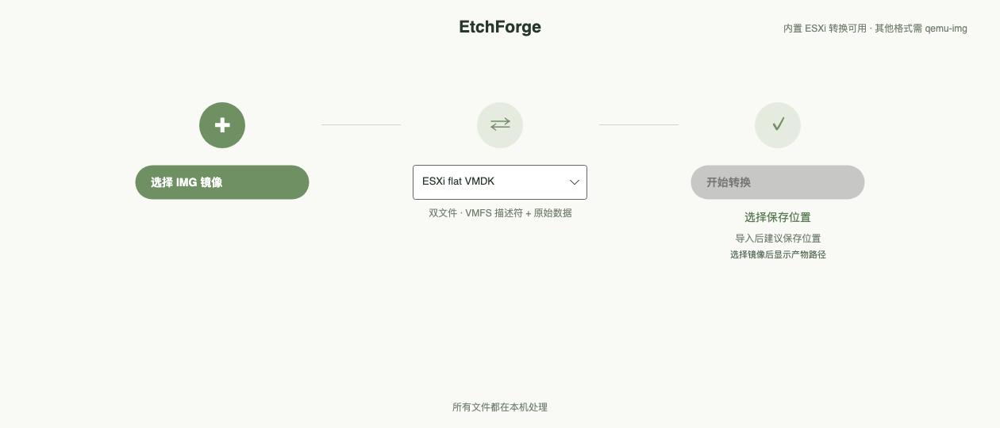

# EtchForge

一个用 Avalonia 12 和 .NET 10 编写的本地磁盘镜像转换桌面应用。固定 21:9 的主窗口沿一条横向流程完成：导入 raw `.img`、选择输出格式、转换并查看产物路径。SHA-256 和 MD5 在导入后通过“查看校验值”展开。不会连接 ESXi、Hyper-V 或其他虚拟机平台。



## 运行

需要 .NET 10 SDK。Windows、macOS 和 Linux 都使用同一份项目：

```sh
dotnet restore
dotnet run
```

应用内置 **ESXi flat VMDK** 转换，无需其他程序。选择 VHD、VHDX、QCOW2 或其他 VMDK 类型时，需要在本机安装 [QEMU 的 `qemu-img`](https://www.qemu.org/docs/master/tools/qemu-img.html)，并将其加入 `PATH`；也可用 `QEMU_IMG_PATH` 环境变量指定可执行文件。macOS Homebrew 通常使用 `brew install qemu`。应用会显示转换引擎检测结果；缺少 `qemu-img` 时仍可使用内置的 ESXi 格式。

## 支持的输出

| 格式 | 实现 | 说明 |
| --- | --- | --- |
| ESXi flat VMDK | 内置 | VMFS 描述符 + 原始数据文件；字节保持不变 |
| VHD | qemu-img | 固定大小 |
| VHDX | qemu-img | 动态大小 |
| QCOW2 | qemu-img | 默认兼容格式 |
| VMDK monolithicSparse | qemu-img | 稀疏单文件 |
| VMDK monolithicFlat | qemu-img | 描述符和数据文件 |
| VMDK twoGbMaxExtentSparse | qemu-img | 2 GB 稀疏分卷 |
| VMDK streamOptimized | qemu-img | 用于 OVF 分发 |

输入目前限定为**完整的 raw 磁盘镜像**，且大小须为 512 字节的整数倍。扩展名为 `.img` 不一定代表 raw；程序会拒绝可识别的 QCOW2、VHDX 和 VMDK 容器，但无法识别所有误命名文件。转换运行前应停止对源镜像的写入。

导入后程序按流读取输入，显示大小、MBR/GPT 概况、SHA-256 和 MD5。输出写入目标目录内的临时文件夹，完成后再移动到目标路径；已有文件不会被覆盖。取消或转换失败时清理临时文件。

## 验证

```sh
dotnet run --project tests/EtchForge.Smoke/EtchForge.Smoke.csproj
```

该测试使用 1 MiB 临时镜像检查哈希、ESXi 描述符和完整字节内容，并通过 Avalonia Headless 加载与渲染界面。测试不依赖 `qemu-img`；其他格式需在已安装 QEMU 的平台上进一步验证。

## 项目结构

- `MainWindow.axaml`：三步式界面。
- `Services/ImageInspector.cs`：格式初筛、磁盘信息和哈希。
- `Services/ConversionService.cs`：内置 ESXi 转换、`qemu-img` 调用、进度和暂存发布。
- `Models/OutputFormat.cs`：支持格式及其转换参数。
- `tests/EtchForge.Smoke`：转换与界面烟测。
